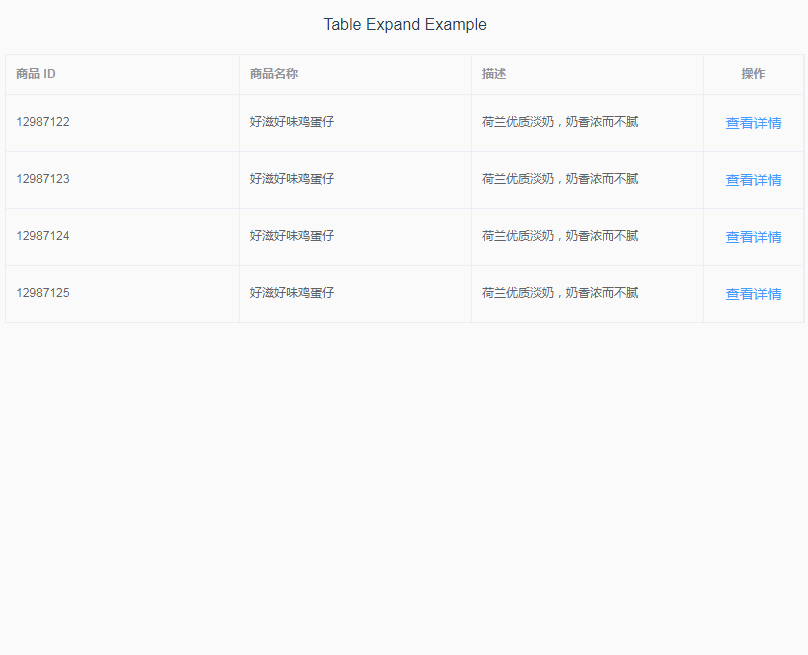

# element-table-expand扩展示例

### 效果预览


### 实现功能
- [x] **基础手风琴效果**
- [x] **修改操作栏文字**
- [x] **修改扩展栏内容**
- 查看博客[使用element-ui table expand展开行实现手风琴效果](https://www.cnblogs.com/e-cat/p/10532982.html)

## Project setup
```
npm install
```

### Compiles and hot-reloads for development
```
npm run serve
```

### Compiles and minifies for production
```
npm run build
```

### Run your tests
```
npm run test
```

### Lints and fixes files
```
npm run lint
```

### Customize configuration
See [Configuration Reference](https://cli.vuejs.org/config/).
